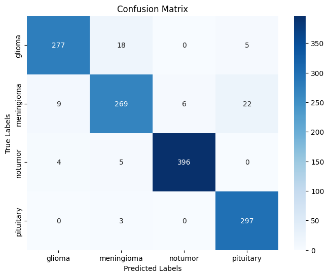
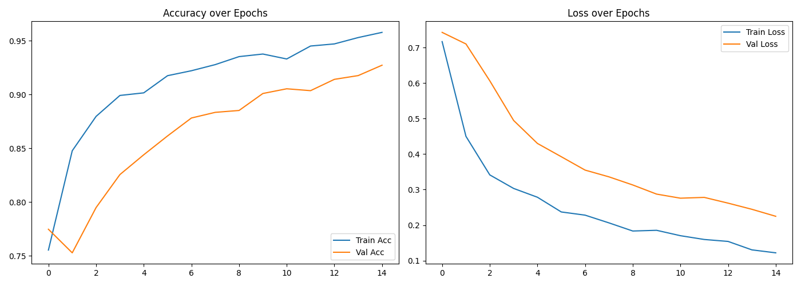

# 🧠 Brain Tumor Classification with Xception

[](https://www.python.org/)
[](https://www.tensorflow.org/)
[](LICENSE)

A deep learning pipeline utilizing **Xception** for multiclass classification of brain tumors from MRI images. This repository provides data preprocessing, augmentation, model training, evaluation, and visualization of results.

---

## 🚀 Project Overview

A transfer-learning approach using the **Xception** architecture pretrained on ImageNet to classify MRI scans into four categories:

* **Glioma**
* **Meningioma**
* **Pituitary Tumor**
* **No Tumor**

This model aims to assist medical professionals with automated, high-accuracy detection and classification of brain tumors.

---

## 📂 Dataset

* **Source:** [Kaggle: Brain MRI Images for Brain Tumor Detection](https://www.kaggle.com/datasets/masoudnickparvar/brain-tumor-mri-dataset)
* **Total images:** 7023

  * **Training:** 4571 images
  * **Validation:** 1141 images (20% split)
  * **Testing:** 1311 images
* **Classes (4):** `glioma`, `meningioma`, `pituitary`, `notumor`

Each MRI is resized to 224×224 pixels and normalized to the \[0,1] range.

---

## 🖼️ Data Preprocessing & Augmentation

```python
train_datagen = ImageDataGenerator(
    rescale=1./255,
    rotation_range=30,
    width_shift_range=0.2,
    height_shift_range=0.2,
    shear_range=0.2,
    zoom_range=0.2,
    horizontal_flip=True,
    validation_split=0.2
)
val_test_datagen = ImageDataGenerator(
    rescale=1./255,
    validation_split=0.2
)
```

* **Rescaling:** pixel values scaled to \[0,1]
* **Augmentations:** rotations (±30°), shifts (±20%), shear, zoom, horizontal flips
* **Batch size:** 32
* **Target size:** 224×224

Visual sample of augmentations:

```python
# sample code to visualize augmentations
for i in range(9):
    plt.subplot(3,3,i+1)
    plt.imshow(augmented_images[i])
    plt.axis('off')
plt.tight_layout()
plt.show()
```

---

## 🏗️ Model Architecture

A `Sequential` model built upon the **Xception** base:

1. **Xception** (ImageNet weights, `include_top=False`, input 224×224×3)
2. `GlobalAveragePooling2D()`
3. Dense(1024, activation='silu') → BatchNorm → Dropout(0.5)
4. Dense(512, activation='silu') → BatchNorm → Dropout(0.4)
5. Dense(256, activation='silu') → Dropout(0.3)
6. Output Dense(4, activation='softmax')

```python
base_model = Xception(weights='imagenet', include_top=False, input_shape=(224,224,3))
base_model.trainable = False
model = Sequential([...])
```

* **Total params:** 23,622,956
* **Trainable params:** 2,758,404 (base frozen)
* **Non-trainable params:** 20,864,552

---

## ⚙️ Training Setup

* **Optimizer:** Adam

  * Phase 1 (feature extraction): lr=1e-4
  * Phase 2 (fine-tuning): lr=1e-5
* **Loss:** Categorical Cross-Entropy
* **Metrics:** Accuracy
* **Callbacks:** EarlyStopping (monitor `val_loss`, patience=5)
* **Class weights:**

  ```python
  {0: 1.0811, 1: 1.0660, 2: 0.8956, 3: 0.9801}
  ```

**Training schedule:**

* **Phase 1:** Freeze Xception, train top layers up to 30 epochs (best at epoch 20)
* **Phase 2:** Unfreeze entire model, fine-tune up to 15 epochs (best at epoch 15)

---

## 📊 Results & Performance Metrics

| Metric        | Train  | Validation | Test   |
| ------------- | ------ | ---------- | ------ |
| Accuracy      | 96.24% | 92.73%     | 94.51% |
| Precision (W) | 96.00% | —          | 94.55% |
| Recall (W)    | 95.57% | —          | 94.51% |
| F1-Score (W)  | 95.78% | —          | 94.48% |

**Per-class Test Accuracy:**

* **Glioma:** 92%
* **Meningioma:** 88%
* **No Tumor:** 98%
* **Pituitary:** 99%

### Confusion Matrix



### Training Curves



The model achieves high reliability across all tumor types, with especially strong performance on non-tumor detection (98%) and pituitary tumors (99%). Glioma and meningioma classification remain robust at 92% and 88%, respectively.

---

## 📄 License

Licensed under the **MIT License**. See [LICENSE](LICENSE) for details.
